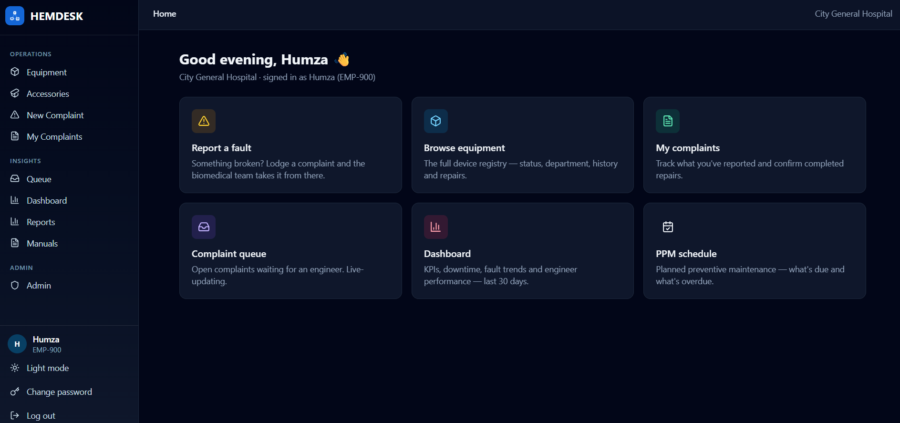
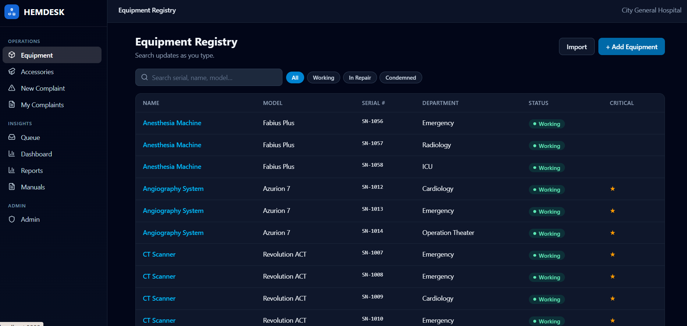
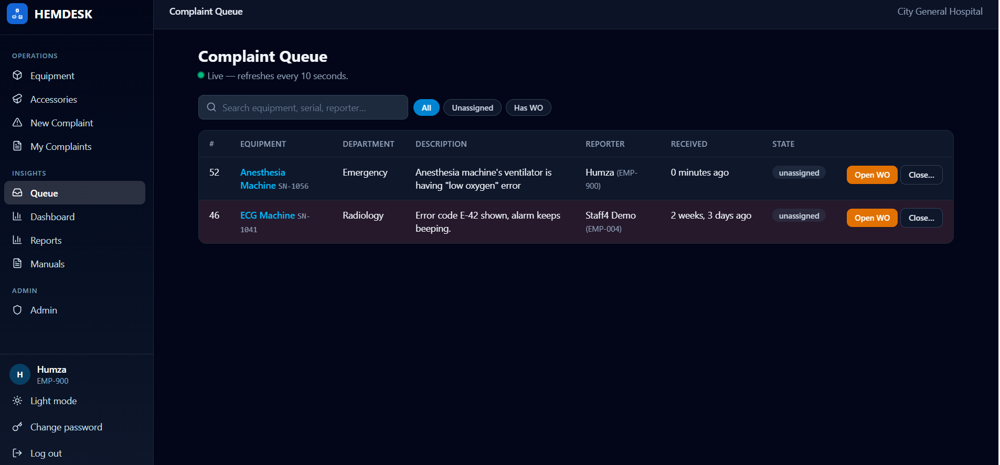

🚧 Work in Progress: This repository is currently under development. Expect incomplete features, breaking changes, and ongoing updates

# HEMDesk — Biomedical CMMS

A hospital medical-equipment management system: one place to track every
device, take a malfunction complaint through to a confirmed repair, keep
preventive maintenance on schedule, and report on all of it. Server-rendered
Django, no separate frontend.

The built-in AI assistant is retrieval-augmented. Every question is answered
from context the app retrieves first: the matching sections of your own
service manuals, and your own past repairs on that model. The assistant is
instructed to ground its answer in that material and to say so plainly when
the material does not cover the question.

**📚 Full documentation:** https://mhumzaarain.github.io/HEMDesk/ (user guide + developer overview).

## Features

- **Equipment registry** — a searchable record of every device. Register one at
  a time or bulk-import from Excel or CSV, edit, and condemn end-of-life
  equipment.
- **Accessories & stock** — accessory types and stock levels, accessories
  attached to devices, and faults and replacements.
- **Complaints & repairs** — ward staff lodge complaints, engineers work them
  through a live queue and work orders, and the reporter confirms the fix.
- **Preventive maintenance** — PPM schedules per device with a due list, so
  nothing gets missed.
- **Dashboard & reports** — 30-day KPIs, downtime and fault trends, and monthly
  PDF reports generated in the background.
- **AI assistant** — troubleshooting chat grounded in uploaded service manuals
  and past repairs on the same model, plus automatic risk scoring for problem
  devices.

## Screenshots








<!-- screenshot: docs/assets/workorder-detail.png -->

## Under the hood

Django 5.2 · PostgreSQL + pgvector · HTMX + Alpine.js + Chart.js + Tailwind ·
Procrastinate (Postgres-backed task queue) · uv for dependency management ·
Docker Compose for development, single-node Docker Swarm for production.

### The retrieval pipeline

Uploaded PDF manuals are split into chunks and indexed — one manual per
manufacturer and model, covering every unit registered under it. When an
engineer asks a question, two retrievers run over the chunks of that device's
manual: Postgres full-text search, and cosine similarity over pgvector
embeddings. The two ranked lists are combined with Reciprocal Rank Fusion, so a
chunk that only one retriever found still surfaces. Every retrieved section
carries the pages it came from, so answers can point back to the source.

The manual is half the context. Up to five completed repairs on the same model
are retrieved alongside it, the closest matches, most recent first, and can be
narrowed to a single fault category — so the answer carries what actually
fixed the fault last time.

If the embedding backend is unreachable, or the stored vectors came from a
different embedding model than the one now configured, retrieval falls back to
keyword-only instead of failing.

The same LLM integration writes the risk-score explanation for high-risk
devices and the narrative in the monthly PDF report.

### Architecture notes

- **Server-rendered.** HTMX and Alpine.js handle live search, the complaint
  queue, and the assistant panel. The compiled CSS is committed, so running
  the app needs no frontend build step.
- **One datastore.** Postgres holds the application data, the full-text search
  index, the embedding vectors, and the task queue. There is no separate search
  engine, vector database, or message broker.
- **Background work.** Manual indexing, assistant answers, monthly report
  generation, and weekly risk scoring all run as Procrastinate tasks, so no
  request waits on an LLM call.
- **Deployment.** Production runs a published image
  (`ghcr.io/mhumzaarain/hemdesk`) on single-node Docker Swarm, with the release
  chosen by one line in `.env`.

## Quickstart

See the [setup guide](https://mhumzaarain.github.io/HEMDesk/developer/setup/) for prerequisites and contributing details.

Terminal 1 — start the app and leave it running:

```bash
uv sync                          # create .venv and install deps (incl. dev)
uv run cli.py init-workspace     # creates .env with generated secrets
uv run cli.py compose-up         # db, ollama, hot-reloading app on :8000
```

Terminal 2 — create the accounts (the stack starts with none, so this is
required before anyone can log in):

```bash
uv run cli.py manage seed_demo
```

Then open <http://127.0.0.1:8000> and log in as **`admin`**. **The password is
the `DEMO_PASSWORD` line in your `.env` file** — `init-workspace` generates a
random one. Want a password you pick yourself? Edit `DEMO_PASSWORD` in `.env`
before running `seed_demo`.

Running Django directly on the host against a Dockerized Postgres is also
still supported — see the [setup guide](https://mhumzaarain.github.io/HEMDesk/developer/setup/).

## Configuring the AI backend

The app talks to any OpenAI-compatible LLM endpoint. The bundled Ollama
container is the default and needs no changes: on `docker compose up` a
one-shot `ollama-init` service pulls the chat and embedding models into the
Ollama volume, so the first run downloads about 2 GB and later runs are
near-instant. To use your own server instead, set `LLM_BASE_URL` and
`LLM_MODEL` in `.env` — add `LLM_API_KEY` for a gateway that needs one.
Embeddings are configured the same way with `EMBEDDING_BASE_URL` and
`EMBEDDING_MODEL`.

`EMBEDDING_DIM` (default 768) is coupled to the database schema: changing it
needs a new migration and a `manage.py reembed_manuals` run. Upgrading an
existing deployment also needs one `reembed_manuals` run after `migrate`, to
embed any manuals showing "keyword search only".

Everything degrades gracefully with no LLM configured: reports generate without
the narrative, risk scores compute without explanations, and manual search
falls back to keyword-only.

**Privacy.** Prompts include complaint and remark free text, engineers'
assistant questions and chat history, service-manual excerpts, and device
details such as serial number and department. Assistant questions also go to
the embedding endpoint. The default bundled Ollama runs locally, so nothing
leaves your deployment — but point `LLM_BASE_URL` or `EMBEDDING_BASE_URL` at an
external endpoint and all of that is sent there.

## Demo accounts & login (development only)

Accounts come from `uv run cli.py manage seed_demo`, which you run once
against a fresh database. Nothing creates them automatically.

**All demo accounts share one password**, read from `DEMO_PASSWORD` in
`.env` when `seed_demo` runs. `cli.py init-workspace` generates a random one
along with the other secrets; set `DEMO_PASSWORD` yourself in `.env` before
running `seed_demo` if you want a known password instead. Change or drop it
before any real deployment.

| Username | Role | Sees |
| --- | --- | --- |
| `admin` | Admin | Everything, plus the Django admin at `/admin/` |
| `engineer1`, `engineer2`, `engineer3` | Engineer | Queue, work orders, dashboard, equipment |
| `staff1` … `staff10` | Staff | Lodge and view their own complaints |

## Production

Production runs on single-node Docker Swarm rather than plain Compose, using
the published image `ghcr.io/mhumzaarain/hemdesk`. Pick the release with the
`IMAGE_TAG` line in `.env`, then deploy:

```bash
uv run cli.py stack-deploy
```

A fresh deployment has no accounts, so nobody can log in until you create the
first administrator. Set `SUPERUSER_USERNAME` and `SUPERUSER_PASSWORD` in
`.env`, deploy, then run `uv run cli.py manage create_superuser`. That account
has the Admin role and can create everyone else from the Django admin. Real
accounts live in the database with hashed passwords — only the one bootstrap
password ever sits in `.env`.

See the [deployment guide](https://mhumzaarain.github.io/HEMDesk/developer/deployment/)
for the one-time Swarm setup, how `.env` reaches the stack, upgrades, and
backups, and [managing user accounts](https://mhumzaarain.github.io/HEMDesk/admin/user-accounts/)
for the first-admin walkthrough and day-to-day account management.

## License

Copyright (C) 2026 Muhammad Humza Arain

This project is licensed under the **GNU Affero General Public License v3.0**
(AGPL-3.0). You may use, modify, and distribute it under the terms of that
license; if you run a modified version as a network service, you must make the
complete corresponding source code available to its users. See the
[`LICENSE`](LICENSE) file for the full text.
