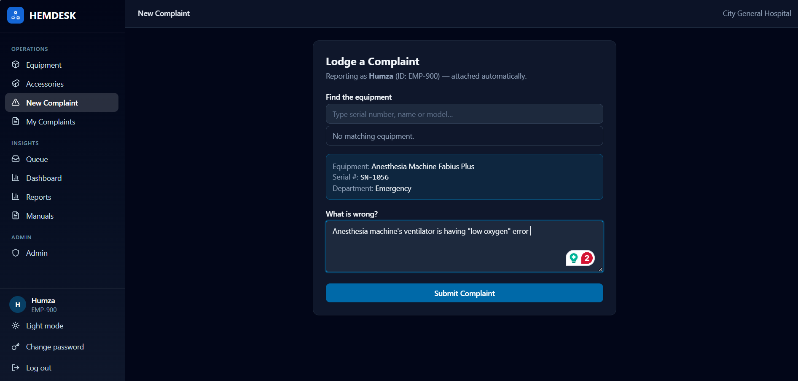

# Lodge a complaint

**Who:** Everyone

Use this whenever a piece of equipment isn't working right and needs an engineer's attention.

1. From the sidebar, select **New Complaint** (or the **Report a fault** card on the home screen).
2. Under **Find the equipment**, search by serial number, name, or model. Only working devices appear in the results.
3. Pick the device from the search results.
4. Describe the fault under **What is wrong?**.
5. Click **Submit Complaint**. The button stays disabled until you've picked a device.

You're attached as the reporter automatically — there's no separate field for it.

!!! note
    You can't lodge a complaint against a condemned device ("complaints are closed") or one that's already under repair — the form tells you the work order number instead.

## What happens next

Your complaint opens with status **Open** and appears in the engineers' queue. If the device already has an open work order, your complaint attaches to it automatically instead of waiting in the queue.
