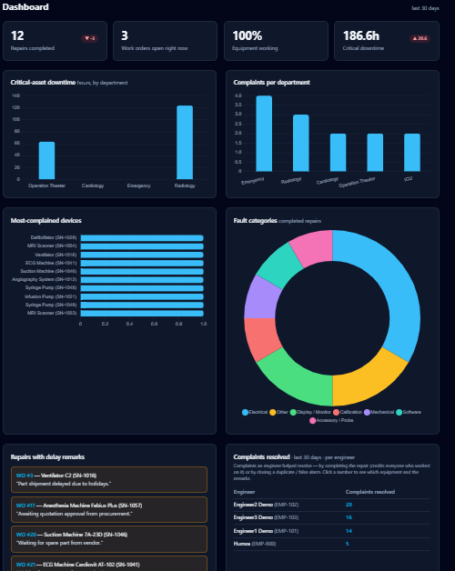

# Reading the dashboard

**Who:** Engineers & Admins

Use this to get a picture of the last 30 days at a glance — repair throughput, equipment health, and where attention is needed — without digging through individual work orders and complaints.

## KPI tiles

Four tiles sit at the top, all covering the last 30 days:

- **Repairs completed** — the count of repairs finished in the window, with a badge showing the change versus the previous 30 days.
- **Work orders open right now** — a live count, not windowed to 30 days.
- **Equipment working** — the percentage of equipment currently in working condition.
- **Critical downtime** — hours of downtime accrued by critical assets, with a change badge versus the previous 30 days. Only critical assets accrue downtime, so this tile ignores everything else.

## Charts

Four charts break the same window down further:

- **Critical-asset downtime** — hours, by department.
- **Complaints per department** — where complaints are coming from.
- **Most-complained devices** — which individual devices are generating the most complaints.
- **Fault categories** — the fault categories of repairs completed in the window.

## Panels

Below the charts:

- **Repairs with delay remarks** — work orders that have picked up a delay note, each linking to the work order.
- **Complaints resolved** — a per-engineer count of complaints resolved in the last 30 days, whether by completing the repair or by closing a duplicate or false alarm. Click a count to see the equipment and remarks behind it.
- **Recent staff confirmations** — the latest ward-staff confirmations, marked **Functional ✓** or **NOT functional ✗**.
- **PPM compliance** — overdue and due-in-30-days counts, a per-department breakdown of overdue schedules, and a link to the full [PPM due list](../ppm/completing.md).
- **Accessory replacements** — top equipment and accessory types replaced over the last 90 days, with a link to the [accessory inventory](../equipment/accessories.md).

## What happens next

The dashboard is read-only — it links out to the work orders, engineer drilldowns, PPM due list, and accessory inventory where you can act on what you see.
