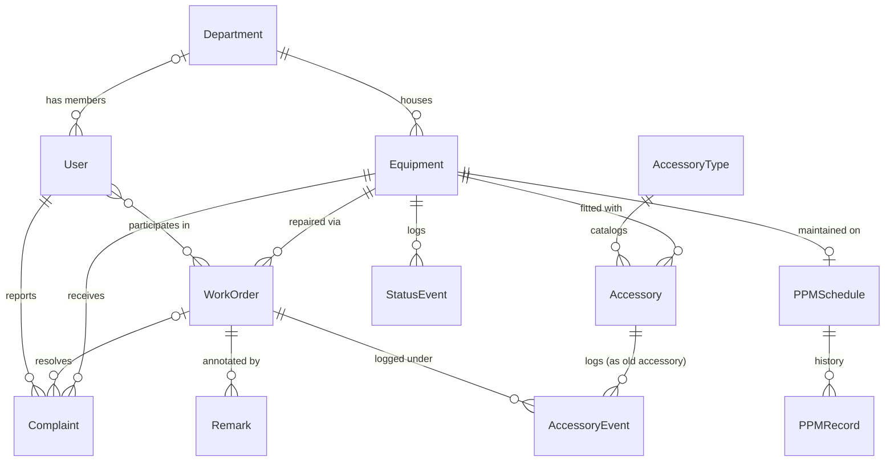

# Data model

This is the core domain — equipment, complaints, work orders, accessories, and preventive maintenance. Reporting and AI models sit on top of it and aren't shown here.

A `User` belongs to a `Department` optionally (staff who file complaints on behalf of a ward may not have one). `AccessoryEvent` also carries an optional `new_accessory` link for replacements, and a required `accessory_type`, on top of the `old_accessory` edge shown above — omitted here to keep the diagram readable.

## Rules worth knowing

- **One active work order per device.** A database constraint (`one_active_workorder_per_equipment`) prevents a second open or in-progress `WorkOrder` from being created for an `Equipment` that already has one.
- **Complaints close automatically on completion.** When a work order is completed or cancelled, every complaint still attached to it that isn't already closed is closed too — `resolved` on completion, `no_fault` on cancellation. There's no separate "close each complaint" step.
- **Stock is a counter, not rows.** Backup spares in the store are tracked as `stock_qty` on `AccessoryType`. Once a unit is fitted to a device it becomes an `Accessory` row with its own status and history — the two are deliberately not the same thing.
- **History tables are append-only.** `StatusEvent`, `AccessoryEvent`, `PPMRecord`, and `Remark` records are never edited or deleted once written — the `AppendOnlyModel` base blocks both. `Equipment`, `WorkOrder`, `Complaint`, and `Accessory` themselves are undeletable too (`NoDeleteModel`), so condemned equipment and condemned accessories stay in the database rather than being removed.
