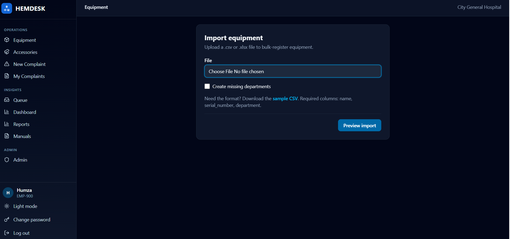

# Import from Excel or CSV

**Who:** Engineers & Admins

Use this to bulk-register equipment instead of adding devices one at a time — for example, when onboarding a department's existing inventory.

Import is a two-step flow: upload and preview, then confirm.

## Step 1: Import equipment

1. From the **Equipment Registry**, click **Import**.
2. Choose a `.csv` or `.xlsx` file.
3. Optionally tick **Create missing departments** if your file references departments that don't exist yet.
4. If you need the format, download the sample CSV linked on the page.
5. Click **Preview import**.

Required columns: `name`, `serial_number`, `department`. Optional columns: `manufacturer`, `vendor`, `model_number`, `purchase_date`, `installation_date`, `is_critical_asset`. Dates must be `YYYY-MM-DD`; the boolean column accepts `true`, `yes`, or `1`. Any extra columns in your file are kept on the device record.

## Step 2: Preview

The preview page shows a banner: "N row(s) will be created; M have errors and will be skipped." Each spreadsheet line appears in a table with either a **create** badge or its list of errors, for example:

- `serial_number already exists`
- `unknown department`
- `bad purchase_date (want YYYY-MM-DD)`
- a duplicate serial number within the file itself

<!-- screenshot: docs/assets/equipment-import-confirm.png -->

Click **Start over** to upload a different file, or **Import N row(s)** to confirm.

!!! note
    Nothing is written to the registry until you confirm. Rows with errors are skipped, not fixed silently — fix your spreadsheet and re-import them if needed.

**What happens next:** You'll see a result message such as "N imported, M skipped," and any skipped rows are listed with their errors so you can fix and re-import them.
